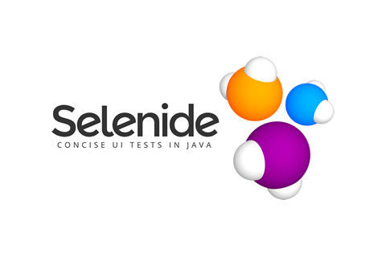

# Автоматизация тестирования официального сайта ERG.

<h1 align="center">
   
  
</h1>

## Расположение
*  - https://github.com/ECLIPSE170790/safron_erg
*  - https://jenkins.autotests.cloud/job/08_eclipse170790_safron_erg

## Используемые инструменты

* 
* 
* 
* 
* 
* 
* 
* 
