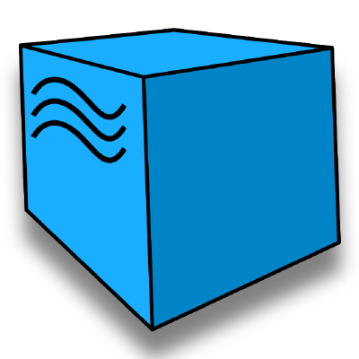

# Автоматизация тестирования официального сайта ERG.

<h1 align="center">
   
  
</h1>

## Расположение
* 
* 

## Используемые инструменты

| IntelliJ IDEA | Java | Gradle | JUnit | Selenide | Selenoid | Allure Report | Telegram |
|:----------:|:------:|:------:|:--------:|:--------:|:-------------:|:---------:|:--------:|
|  |  |  |  |  |  |  |  |
