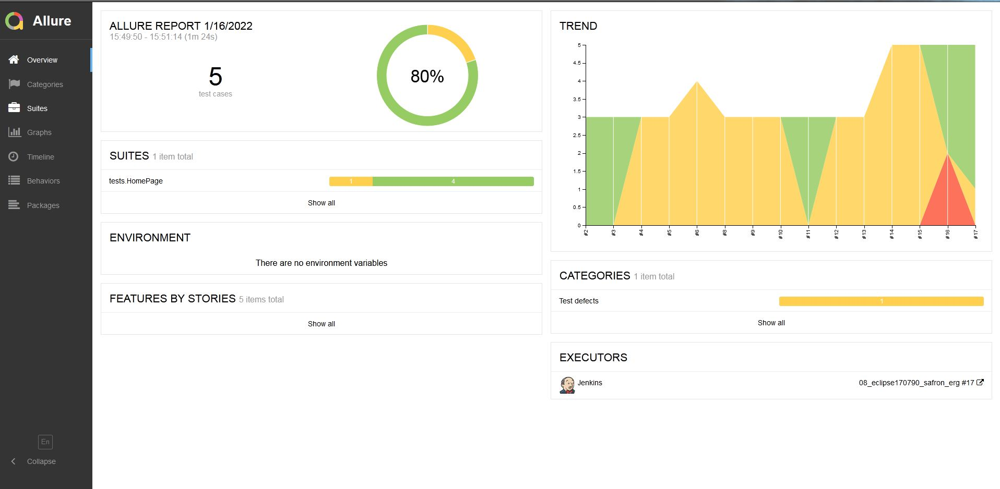
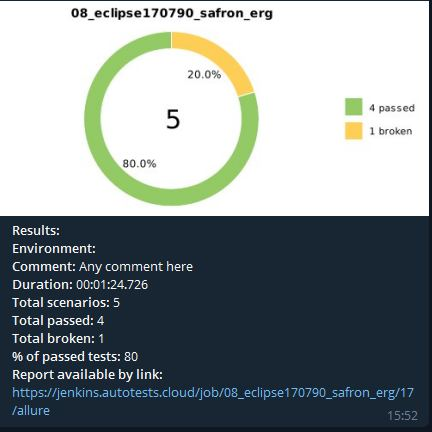

# Автоматизация тестирования официального сайта ERG.

<h1 align="center">
   
  
</h1>

## Расположение
* Репозиторий в GithUb 
* Сборка в Jenkins 

## Используемые инструменты

| IntelliJ IDEA | Java | Gradle | JUnit | Selenide | Selenoid | Allure Report | Telegram |
|:----------:|:------:|:------:|:--------:|:--------:|:-------------:|:---------:|:--------:|
|  |  |  |  |  |  |  |  |

## Используемые параметры по умолчанию
* Адрес страницы - https://www.erg.kz/ru
* Браузер - Chrome

## Отчётность можно посмотреть в "Allure Report"

## Результаты запуска автотестов приходят в "Телеграм"

## Список автотестов
* Проверка наличия слова "Главная" на главной странице.
* Проверка отправки кода подтверждения на мобильный телефон.
* Проверка работы поиска со словом "BTS".
* Проверка наличия города Экибастуз на карте площадок.
* Проверка наличия "Портала закупок" после перехода в раздел "Закупки".